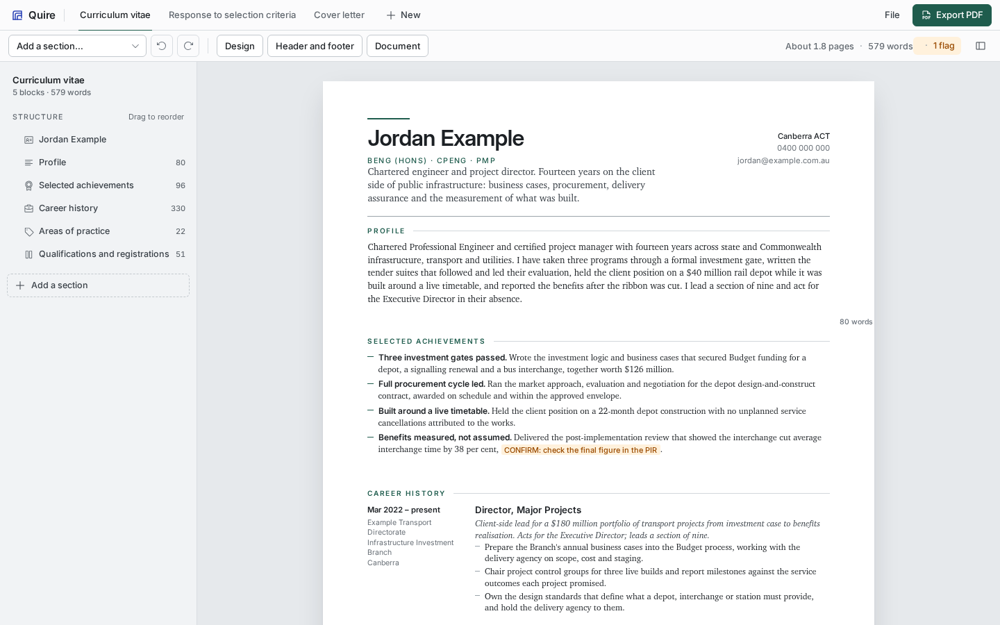

<p align="center">
  
</p>

<h1 align="center">Quire</h1>

<p align="center">
  One file for a job application: a CV, a response to selection criteria and a cover letter,
  edited in the finished design and printed to PDF.
</p>

<p align="center">
  <a href="https://github.com/mjgardner87/Quire/actions/workflows/ci.yml"></a>
  <a href="LICENSE"></a>
  
  
</p>

<p align="center">
  
</p>

---

Quire holds the three documents an application needs, lets you edit them in place in the design
that prints, counts words against the limits a panel sets, and prints to PDF from the browser.
It is one HTML file. It has no server, no account and no telemetry, and your documents never
leave your machine.

A quire is a gathering of sheets.

## Use it

1. Download `dist/index.html` and open it in Chrome or Chromium. Firefox works, without running
   headers and footers.
2. The sample workspace opens. Click any text and type. Enter adds a bullet or paragraph.
   Backspace on an empty one removes it.
3. Use the structure rail on the left to reorder, remove or add sections. Drag a row, or use its
   buttons. Point at a block on the page to see the same controls in the right margin.
4. Set the colour scheme, type and margins under Design. Set page headers and footers under
   Header and footer. Set word limits and criterion numbering under Document.
5. Choose File, then Save file, to keep a `.quire.json` file with the application it belongs to.
   Edits also autosave in the browser.
6. Click Print and choose Save as PDF.

### Flags

Text between `[[` and `]]` is a flag. It prints amber and the toolbar counts it, so a fact you
still have to confirm cannot slip into a submission. To flag words: select them and use the
toolbar that appears, right-click them, or press Ctrl+Shift+F.

Ctrl+K opens a command palette with every action, every section type and a jump to any block.

### Keyboard

| Keys | Action |
|---|---|
| Enter | New bullet or paragraph after this one |
| Backspace | On an empty bullet or paragraph, remove it |
| Ctrl+B, Ctrl+I | Bold, italic |
| Ctrl+Shift+F | Flag the selected words, or the word at the caret |
| Ctrl+K | Command palette |
| Right-click | Actions for the text under the pointer (Shift and right-click keeps the browser's menu) |
| Alt+Up, Alt+Down | Move this bullet, paragraph or entry |
| Alt+Shift+Up, Alt+Shift+Down | Move the whole section |
| Ctrl+Z, Ctrl+Shift+Z | Undo, redo a structural change (outside text) |
| Ctrl+S, Ctrl+O, Ctrl+P | Save file, open file, print |
| Esc | Close a panel |
| ? | Show the shortcuts |

### Headers and footers

Each document has three header slots and three footer slots. They accept `{page}`, `{pages}`,
`{name}`, `{title}` and `{date}`. Chromium 131 and later print them through CSS page margin
boxes. Other browsers print the page without them.

## Build it

```sh
npm install
npm run dev        # Vite dev server
npm run build      # dist/index.html, one self-contained file
npm test           # typecheck, unit tests, build, drift check, browser tests
```

Node 24 or later. The browser suite reads the printed PDF with `pdfinfo` and `pdftotext`, so it
needs poppler-utils (`sudo dnf install poppler-utils`, or `sudo apt install poppler-utils`).

Fonts: Inter and Source Serif 4 load from Google Fonts. If XCharter is installed on the machine,
the body uses it.

`dist/index.html` is committed. `npm run check` fails when it differs from a fresh build, so
rebuild before you commit a change under `src/`.

### Embed your own workspace

The build embeds `src/seed.json` as the sample. To ship a copy with your own workspace inside
it, so the file opens straight onto your documents:

```sh
QUIRE_SEED=/path/to/application.quire.json npm run build
cp dist/index.html "/path/to/application/Application Editor.html"
```

Edits in that copy autosave under its own path in the browser. Save a file before you move it.

### Render a PDF without a browser window

```sh
chromium-browser --headless --disable-gpu --no-sandbox \
  --allow-file-access-from-files --no-pdf-header-footer --virtual-time-budget=5000 \
  --print-to-pdf=cv.pdf "file:///path/to/index.html#cv"
```

`#cv` selects the document by id. With `--allow-file-access-from-files`, `?open=file.json` loads
a workspace from a file beside the page.

## Files

| Path | What it is |
|---|---|
| `src/model.ts` | Types, templates, word counts, migration, the `@page` rule, plain text and Markdown export. No DOM. |
| `src/render.ts` | Document to DOM, with editing controls. |
| `src/editor.ts` | State, storage, history, panels, structure rail, events. |
| `src/text.ts` | Model text to editable DOM and back. Bold, italic and flags are plain markers in the model. |
| `src/styles/document.css` | The printed design. Sizes are relative to `--base`, spacing to `--density`. |
| `src/styles/editor.css` | Editor chrome. Screen only. |
| `src/seed.json` | The fictional sample workspace. |
| `test/unit` | Vitest, for the model. |
| `test/e2e` | Playwright, against `dist/index.html`. |

## File format

A workspace is JSON: `format`, `design`, and `documents`. Each document has an `id`, a `title`,
a `kind` (`cv`, `criteria`, `letter` or `blank`), `numbering`, optional `wordLimit` and
`blockWordLimit`, `running` header and footer slots, and `blocks`. Block types: `masthead`,
`docmast`, `section` (kinds `prose`, `achievements`, `entries`, `columns`, `skills`), `opening`,
`criterion`, `closing`, `letterhead`, `signoff`. Any block may carry `pageBreak: true`.

Files from the first-generation editor (`{ cv: ..., criteria: ... }`) open and migrate.

## Your data

Documents stay in the browser, under a key that includes the file's own path, and in the
`.quire.json` file you save. Nothing is sent anywhere. The repository holds no personal data:
the sample workspace is fictional.

## Contributing

`main` is protected. Every change lands as a pull request that passes the gate and that the
owner reviews and merges. Read [CONTRIBUTING.md](CONTRIBUTING.md) before you open one.

Report a vulnerability privately. Read [SECURITY.md](SECURITY.md); do not open a public issue.

## Documents

| File | What it records |
|---|---|
| [`PRODUCT.md`](PRODUCT.md) | What Quire is for and what it will not do. |
| [`DESIGN.md`](DESIGN.md) | The visual system: type, colour, spacing, the mark. |
| [`CLAUDE.md`](CLAUDE.md) | How to work in this repository. |

## Licence

MIT. See [LICENSE](LICENSE). Icons are Phosphor Icons, MIT.
